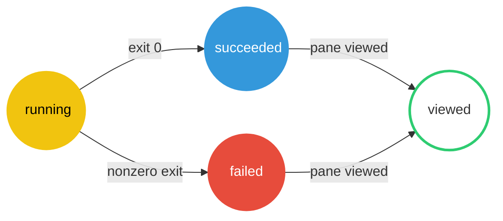

# Herdr shell status

[Herdr](https://herdr.dev) is a terminal multiplexer like tmux, but it's aware of coding agents: every pane running an agent gets a status dot showing whether the agent is working, blocked on your answer, or idle.

This Zsh plugin gives plain CLI commands the same dots. Every command run in a Herdr pane is marked:

-  **Yellow** while it runs.
-  **Blue** if it succeeds (exit 0).
-  **Red** if it fails (nonzero exit).
-  **Green** once you view the pane, clearing the status.



## Install

### Oh My Zsh

Clone the repository into the custom plugin directory:

```console
git clone https://github.com/motlin/herdr-shell-status.git \
  "${ZSH_CUSTOM:-$HOME/.oh-my-zsh/custom}/plugins/herdr-shell-status"
```

Add `herdr-shell-status` to the plugin list in `.zshrc`:

```zsh
plugins=(... herdr-shell-status)
```

### Direct source

Clone the repository anywhere, then source it from `.zshrc`:

```zsh
if [[ -r "$HOME/projects/herdr-shell-status/herdr-shell-status.plugin.zsh" ]]; then
  source "$HOME/projects/herdr-shell-status/herdr-shell-status.plugin.zsh"
fi
```

## Automatic reporting

Every command entered in the pane's root Zsh reports automatically. Command text and arguments are never sent to Herdr, only the exit status.

Nested shells, including those launched by Claude or Codex, do not report. Native agent CLIs take lifecycle ownership when launched, so their richer Herdr integrations keep working.

Toggle with `herdr_shell_status_disable` / `herdr_shell_status_enable`. Set `HERDR_SHELL_STATUS_DELEGATES` before sourcing to replace the default delegate list.

## License

Apache-2.0.
