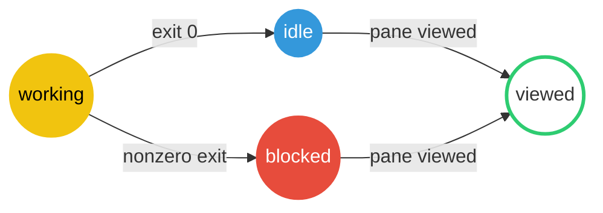

# Herdr shell status

[Herdr](https://herdr.dev) is a terminal workspace like tmux, except every pane shows a status dot: yellow while your agent runs, red when it's blocked on your answer, blue when it finishes its turn, and green once you've looked.

This Zsh plugin gives ordinary shell commands the same dots. Run `make` in a Herdr pane:

-  **Yellow** while it runs.
-  **Red** if it exits with a nonzero code.
-  **Blue** if it exits with code zero.
-  **Green** when you view the pane, clearing the status.

All dots are solid except green, which is hollow.



## Install

### Oh My Zsh

Clone the repository into the custom plugin directory:

```console
git clone https://github.com/motlin/herdr-shell-status.git \
  "${ZSH_CUSTOM:-$HOME/.oh-my-zsh/custom}/plugins/herdr-shell-status"
```

Add `herdr-shell-status` to the plugin list in `.zshrc`:

```zsh
plugins=(... herdr-shell-status)
```

### Direct source

Clone the repository, then source it from `.zshrc`:

```zsh
if [[ -r "$HOME/projects/herdr-shell-status/herdr-shell-status.plugin.zsh" ]]; then
  source "$HOME/projects/herdr-shell-status/herdr-shell-status.plugin.zsh"
fi
```

The plugin adds its `bin` directory to `PATH`, making `herdr-run` available without a separate link. It requires `herdr`,
`jq`, `HERDR_ENV=1`, and `HERDR_PANE_ID`. It fails open when any requirement is unavailable.

## Automatic reporting

Every command entered in the pane's root Zsh reports through the `user:zsh-command` source with the `cli` label:

- working (yellow) while the command runs
- idle (blue) after exit status 0 or a common interruption status
- blocked (red) after any other nonzero status

Command text and arguments are never sent to Herdr. A failure message includes only the exit status.

The integration activates only in the root interactive shell of a Herdr pane. Nested interactive shells—including shells launched by Claude or Codex—do not report command activity. Native agent CLIs receive lifecycle ownership when launched, so their richer Herdr integrations continue to work.

The plugin releases its lifecycle authority before `exec`, `herdr-run`, and known native agent CLIs. Set `HERDR_SHELL_STATUS_DELEGATES` before sourcing the plugin to replace the default delegate list.

Use `herdr_shell_status_disable` or `herdr_shell_status_enable` to control reporting in the current shell.

## Explicit wrapper

Use `herdr-run` when a script, automation, or non-Zsh shell should report one command:

```console
herdr-run --label build -- vp build
```

The wrapper preserves the wrapped command's exit status. Its final state remains visible until the pane receives focus, then a detached watcher releases the lifecycle entry. Outside Herdr, it directly executes the command.

Add the repository's `bin` directory to `PATH` to invoke `herdr-run` by name.

## Validate

```console
mise install
bin/check
```

`bin/check` runs the Just-based syntax, ShellCheck, test, formatting, and linting pipeline. The test suite uses a fake Herdr executable and does not modify live pane state.

## Status dot reference

The dot colors map to the Herdr lifecycle states used throughout the code:

| Dot          | State     | Shell command   | Herdr agent             |
| ------------ | --------- | --------------- | ----------------------- |
| solid yellow | `working` | command running | agent running           |
| solid red    | `blocked` | nonzero exit    | waiting for your answer |
| solid blue   | `idle`    | exit 0          | turn finished           |
| hollow green | viewed    | status cleared  | status cleared          |

## License

Apache-2.0.
